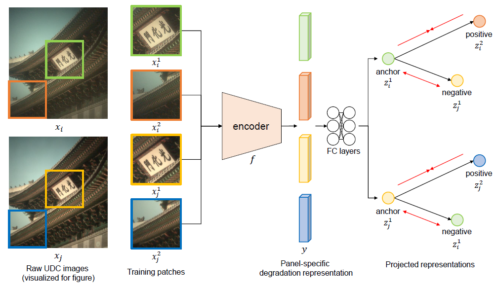
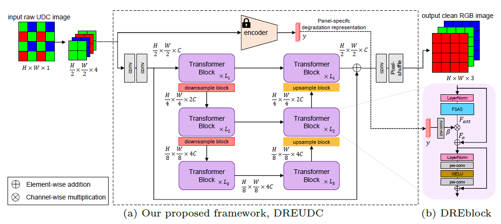
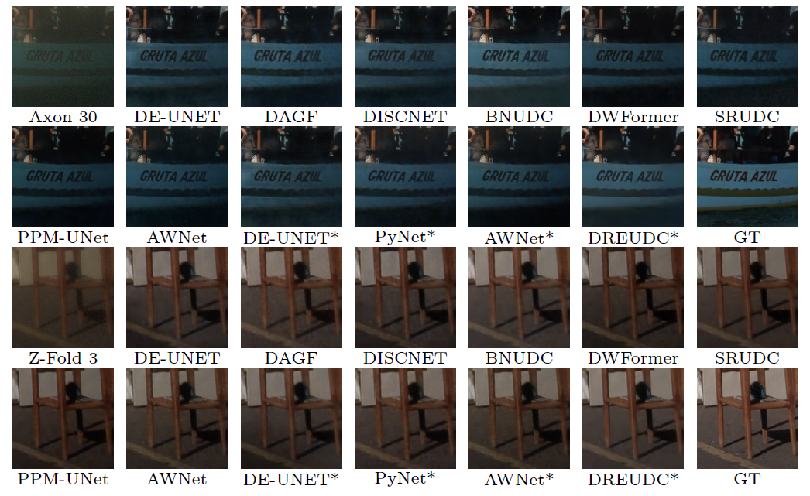

# DREUDC
[ECCV2024] Panel-Specific Degradation Representation for Raw Under-Display Camera Image Restoration

## Abstract
Under-display camera (UDC) image restoration aims to restore images distorted by the OLED display panel covering the frontal camera on a smartphone. Previous deep learning-based UDC restoration methods focused on restoring the image within the RGB domain with the collection of real or synthetic RGB datasets. However, UDC images in these datasets exhibit domain differences from real commercial smartphone UDC images while inherently constraining the problem and solution within the RGB domain. To address this issue, we collect well-aligned sensor-level real UDC images using panels from two commercial smartphones equipped with UDC. We also propose a new UDC restoration method to exploit the disparities between degradations caused by different panels, considering that UDC degradations are specific to the type of OLED panel. For this purpose, we train an encoder with an unsupervised learning scheme using triplet loss that aims to extract the inherent degradations caused by different panels from degraded UDC images as implicit representations. The learned panel-specific degradation representations are then provided as priors to our restoration network based on an efficient Transformer network. Extensive experiments show that our proposed method achieves state-of-the-art performance on our real raw image dataset and generalizes well to previous datasets.

## Environment
* Ubuntu 18.04
* Python 3.7.16
* PyTorch 1.13.1+cu117
* CUDA 9.1.85

## Overview of Our Proposed Method (DREUDC)

<p align="center"></p>

Our proposed method on training an encoder to learn panel-specific degradation representations. The encoder remains frozen after this stage.

<p align="center"></p>

Overall framework of DREUDC, which utilizes the panel-specific degradation representation encoder by embedding the encoder output to the restoration network.

## Datasets & Pretrained Models
Our collected dataset can be downloaded via this link. 

Pretrained models of DREUDC and the compared methods are also available via the same link. Unzip the files under `/pretrained_models`.
* [Google Drive](https://drive.google.com/drive/folders/1k4RQQJhNNKa3J_XC0lI2XGojL8xWCUA9?usp=sharing)

You can use our MATLAB code raw2rgb.m, or any other conversion methods to generate rgb images.

Our dataset can only be used for non-commercial research purposes under the condition of properly attributing the original authors. All the images are collected from DIV2K dataset. The copyright belongs to SK hynix Inc. and the original dataset owners.

## Experimental Results

**Visualized results on our collected dataset, Axon 30 and Z-Fold 3**
<p align="center"></p>

## Citation
```
@inproceedings{oh2024panel,
  title={Panel-Specific Degradation Representation for Raw Under-Display Camera Image Restoration},
  author={Oh, Youngjin and Lee, Keuntek and Lee, Jooyoung and Lee, Dae-Hyun and Cho, Nam Ik},
  booktitle={European Conference on Computer Vision},
  year={2024}
}
```

## Contact
If you have any questions, please reach us by e-mail (yjymoh0211@snu.ac.kr).

## Acknowledgements
This project is based on the following projects. We thank the authors for releasing their great work as open-source.
* [FFTformer](https://github.com/kkkls/FFTformer)
* [NAFNet](https://github.com/megvii-research/NAFNet)
* [Restormer](https://github.com/swz30/Restormer)
* [DASR](https://github.com/csjliang/DASR)
* [BNUDC](https://github.com/JaihyunKoh/BNUDC)
* [SRUDC](https://github.com/NamecantbeNULL/SRUDC)
* [DAGF](https://github.com/varun19299/deep-atrous-guided-filter)
* [DWFormer](https://github.com/SummerParadise-0922/MPGNet)
* [PPM-UNet](https://github.com/jnjaby/AlignFormer)
* [AWNet](https://github.com/Charlie0215/AWNet-Attentive-Wavelet-Network-for-Image-ISP)
* [PyNet](https://github.com/aiff22/PyNET)
